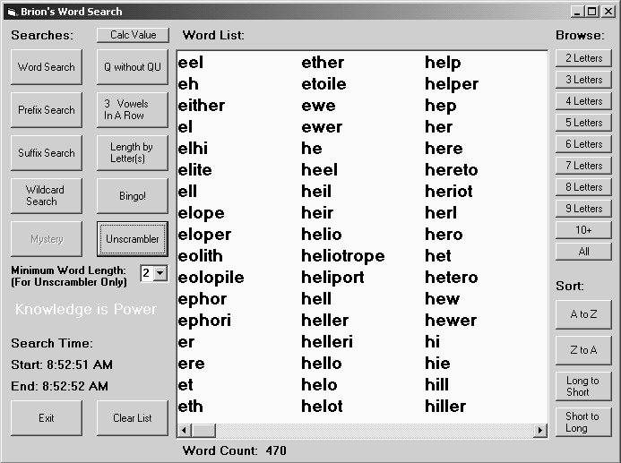



## BrionWordSearch

### Description

This program is a word search program using a list of over 173,000 words, a listing called enable3 used in Scrabble tournaments. Some of the functions include searching by word (uses a hash search by Philippe Lord), prefix, suffix, wildcard, and several word list browses. The program also includes an unscramble function which will list all words that can be made from a letter set, with support for wildcards or blanks. A couple of searches are specifically targeted to be a help with playing Scrabble. This is my first submission!
 
### More Info
 

             |
---                |---
**Submitted On**   |2002-03-12 08:45:44
**By**             |[Brion](https://github.com/Planet-Source-Code/PSCIndex/blob/master/ByAuthor/brion.md)
**Level**          |Beginner
**User Rating**    |5.0 (75 globes from 15 users)
**Compatibility**  |VB 6\.0
**Category**       |[Games](https://github.com/Planet-Source-Code/PSCIndex/blob/master/ByCategory/games__1-38.md)
**World**          |[Visual Basic](https://github.com/Planet-Source-Code/PSCIndex/blob/master/ByWorld/visual-basic.md)
**Archive File**   |[BrionWordS615733122002\.zip](https://github.com/Planet-Source-Code/brion-brionwordsearch__1-32614/archive/master.zip)

